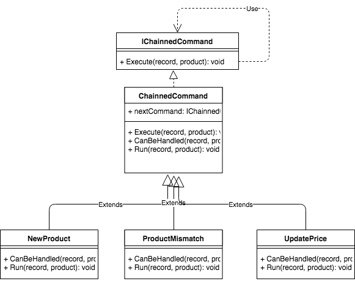

# Chain of responsibility

Recently I was asked to implement simple pricing "engine". Main responsibility was to fetch product informations form external source and then based on given set of rules decide what to do. If one rule is applicable then other rules should not be checked. My idea was to use Chain of Responsibility for that:

> Avoid coupling the sender of request to its receiver by giving more than one object a chance to handle the request. Chain the receiving objects and pass the request along the chain until an object handles it.

Based on this description this is what we have been looking for. I decided to put each rule and linked action in separate handler class. Each one of those classes implement ICommand interface. All classes are joined with next property that points to next handler in chain. If one of the handlers handles request then chain is stopped.



Particular interesting can be abstract class and inherited class:

```csharp
    public abstract class ChainnedCommand : IChainedCommand
    {
        private readonly IChainedCommand _nextCommand;

        public ChainnedCommand(IChainedCommand nextCommand)
        {
            _nextCommand = nextCommand;
        }

        public void Execute(ProductRecord productRecord, Product product)
        {
            if (!CanBeHandled(productRecord, product) && _nextCommand != null)
            {
                _nextCommand.Execute(productRecord, product);
                return;
            }

            Run(productRecord, product);
        }

        protected abstract bool CanBeHandled(ProductRecord productRecord, Product product);

        protected abstract void Run(ProductRecord productRecord, Product product);
    }
```

```csharp
    public class UpdatePrice : ChainnedCommand
    {
        private readonly ILogger _logger;
        private readonly IPriceConverter _priceConverter;
        private readonly IRepository<Product> _productRepository;
        private readonly IRepository<Price> _priceRepository;

        public UpdatePrice(
            ILogger logger,
            IPriceConverter priceConverter,
            IRepository<Product> productRepository,
            IRepository<Price> priceRepository,
            IChainedCommand nextUpdater) : base(nextUpdater)
        {
            _logger = logger;
            _priceConverter = priceConverter;
            _productRepository = productRepository;
            _priceRepository = priceRepository;
        }

        protected override bool CanBeHandled(ProductRecord productRecord, Product product)
        {
            return product != null && string.Equals(productRecord.Name, product.Name) && GetPriceInCents(productRecord, product) != product.Price;
        }

        protected override void Run(ProductRecord productRecord, Product product)
        {
            product.UpdatePrice(GetPriceInCents(productRecord, product));
            _productRepository.Update(product);
            _priceRepository.Create(Price.Create(product));
        }

        private int GetPriceInCents(ProductRecord productRecord, Product product)
        {
            if (!_priceConverter.TryConvert(productRecord.Price, out var priceInCents))
            {
                _logger.LogError($"Could not convert price to cents productRecord: {productRecord}, product : {product}");

                // I don't know how to deal with that so I'm closing application
                throw new ApplicationException($"Could not convert price to cents productRecord: {productRecord}, product : {product}");
            }

            return priceInCents;
        }
    }
```
