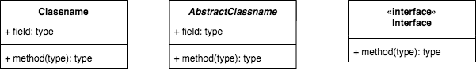
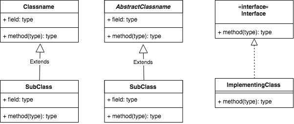
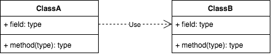

# How to read class diagrams

Let me explain simplified version of [Unified Modelling Language](https://pl.wikipedia.org/wiki/Unified_Modeling_Language) which I will use to illustrate class hierarchies and connections between them.

### Types

Each type is separated into three parts. First contains type name and second contains list of field, properties. Last one contains of a list of methods.

### Inheritance

Inheritance is represented by line with hollow triangle. It points to the class being inherited from or interfaces being implemented. Solid line is for classes and dashed for interfaces.

### Relations

Relations are represented by dashed line with an open arrow that points to class that is used by other one. It does not matter how used class is passed or initiated. We are only interested that is used by other class.

